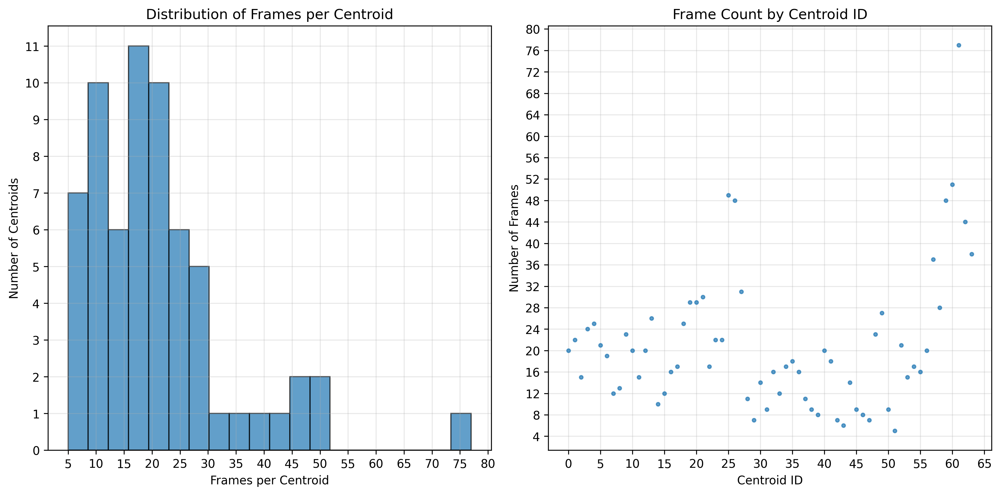

# HMM for Command Recognition

## MFCC Coeffcients 256

- 20 recordings per word
    - 5 different speakers
- 16k samplerate, mono


```
Vocabulary:
    backward  
    begin
    down
    finish
    forward
    left
    right
    rotate
    stop
    up
```

## HMM Training

### Results


```
    Classification Report:
                  precision    recall  f1-score   support

        backward       1.00      1.00      1.00         4
           begin       1.00      0.50      0.67         4
            down       1.00      1.00      1.00         4
          finish       1.00      1.00      1.00         4
         forward       0.80      1.00      0.89         4
            left       1.00      0.50      0.67         4
           right       0.75      0.75      0.75         4
          rotate       0.57      1.00      0.73         4
            stop       0.80      1.00      0.89         4
              up       1.00      0.75      0.86         4

        accuracy                           0.85        40
       macro avg       0.89      0.85      0.84        40
    weighted avg       0.89      0.85      0.84        40

Overall Accuracy: 85.00%
```

### Problems

- Logarithm likelihodd sometimes decreases with iterations higher than 100
- When updating the $b_{j}(k)$ in the Maximization step:
$$
b_j(k) = \frac{\text{ sum  $y_t(j)$ when $O_{t}=k$, across all sequences}}{\text{sum of $\gamma_{t}(j)$ across all $t$ and all sequences}}
$$

If there are no $O_{t}=k$ then instead of setting the log probability to `float('inf')` it is set to `log(1e-20)`. This shouldn't work. But if I put `float('inf')` the training doesn't work at all.


## MFCC Coefficients Distribution

- 4 words
- 10 recordings per words
    - 20ms frames with 10ms overlap
- 16k sample rate mono
- max iterations 100, but all converged 
- one speaker
- 64 centroids




