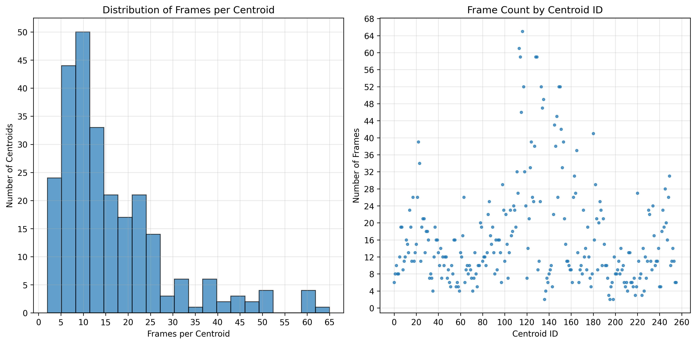

# 🎤 HMM Command Recognition System

A speech recognition system that uses MFCC features and Hidden Markov Models to recognize voice commands from a 10-word vocabulary.

## 🎯 Overview

**Recognition Vocabulary**: `backward`, `begin`, `down`, `finish`, `forward`, `left`, `right`, `rotate`, `stop`, `up`

**Dataset**: 20 recordings per word from 5 different speakers (16kHz, mono)

**Current Performance**: 85% accuracy

## 📁 Project Structure

```
Project/
├── 📂 CodeVector/          # MFCC codevector generation
├── 📂 Data/
│   ├── 📂 Processed/       # Preprocessed .npy files
│   └── 📂 Raw/            # Original .wav recordings
├── 📂 HMM/                # HMM training and testing
├── 📂 Plots/              # Generated visualizations
├── 🧹 clean_data.py       # Data cleaning utilities
├── 🎚️ preemphasis.py      # Audio preprocessing
├── 📋 requirements.txt    # Dependencies
└── 📖 README.md
```

## 🚀 Quick Start

### Prerequisites
```bash
# Install dependencies (conda recommended)
pip install -r requirements.txt

# Download training data
```
📥 [Training Data](https://drive.google.com/drive/folders/1r35O4WQyxVhFaf3DXvZsIIZJ7llQ4lxk?usp=sharing)

Place audio files in `Data/Raw/` organized by command folders.

### Processing Pipeline

#### 1️⃣ Audio Preprocessing
```bash
python preemphasis.py
```
Applies preemphasis filtering → outputs `.npy` files to `Data/Processed/`

#### 2️⃣ Create 256-D MFCC Codevector
```bash
cd CodeVector/
python main.py a          # Full pipeline
# OR
python main.py            # Interactive menu
```
- Converts `.npy` to `RawDataMFCC` format (`.json`)
- **Optional**: `python analysis_utils_enhanced.py mfcc` for statistics

#### 3️⃣ Train HMM
```bash
cd HMM/
python main.py train
```

#### 4️⃣ Test HMM
```bash
cd HMM/
python main.py test
```

#### 5️⃣ Live Recognition
```bash
cd HMM/
python live_testing.py
```

## 📊 Results

### MFCC Feature Distribution


### Recognition Performance


| Metric | Score |
|--------|-------|
| **Overall Accuracy** | **85.00%** |
| Macro Average Precision | 0.89 |
| Macro Average Recall | 0.85 |
| Macro Average F1-Score | 0.84 |

#### Per-Command Performance
| Command | Precision | Recall | F1-Score |
|---------|-----------|--------|----------|
| backward | 1.00 | 1.00 | 1.00 |
| begin | 1.00 | 0.50 | 0.67 |
| down | 1.00 | 1.00 | 1.00 |
| finish | 1.00 | 1.00 | 1.00 |
| forward | 0.80 | 1.00 | 0.89 |
| left | 1.00 | 0.50 | 0.67 |
| right | 0.75 | 0.75 | 0.75 |
| rotate | 0.57 | 1.00 | 0.73 |
| stop | 0.80 | 1.00 | 0.89 |
| up | 1.00 | 0.75 | 0.86 |

## ⚙️ Algorithm Details

### Baum-Welch Implementation

#### Forward-Backward Variables

**Initialization:**

$$
\alpha_{1}(i) = \pi_{i} * b_{i}(O_{1}) 
$$
$$
\beta_{T}(i) = 1, \text{ for all states i}
$$

**Recursion:**

$$
\alpha_{t}(i) = [\sum_{j=1}^{N} \alpha_{t-1}(j) * a_{ij}] * b_{i}(O_{t})
$$
$$
\beta_t(i) = \sum_{j=1}^N [a_{ij} × b_j(O_{t+1}) × β_{t+1}(j)]
$$

#### Expectation Step

$$
\gamma_{t}(i) = \frac{\alpha_{t}(i) \times \beta_{t}(i)}{P(O|\lambda)}
$$
$$
\xi_{t}(i,j) = \frac{\alpha_{t}(i) \times a_{ij} \times b_{j}(O_{t+1}) \times \beta_{t+1}(j)}{P(O|\lambda)}
$$

#### Maximization Step

$$
\pi_{i} = \frac{\text{sum of } \gamma_{1}(i) \text{ across all training sequences}}{\text{number of training sequences}}
$$
$$
a_{ij} = \frac{\text{sum of } \xi_{ij} \text{ across al $t$ and all sequences}}{\text{sum of $\gamma_{t}(i)$ across all $t$ and all sequences}}
$$
$$
b_j(k) = \frac{\text{ sum  $y_t(j)$ when $O_{t}=k$, across all sequences}}{\text{sum of $\gamma_{t}(j)$ across all $t$ and all sequences}}
$$

## ⚠️ Known Issues

1. **Log-likelihood convergence**: Sometimes decreases after 100+ iterations
2. **Zero probability handling**: When no observations match symbol k in b_j(k), using `log(1e-20)` instead of `-∞` (which breaks training)

## 📋 Data Format

Organize audio files as:
```
Data/Raw/
├── backward/
│   ├── speaker1_backward_1.wav
│   └── ...
├── begin/
└── ...
```

---
*MFCC Feature Extraction • Baum-Welch Training • Real-time Recognition*

